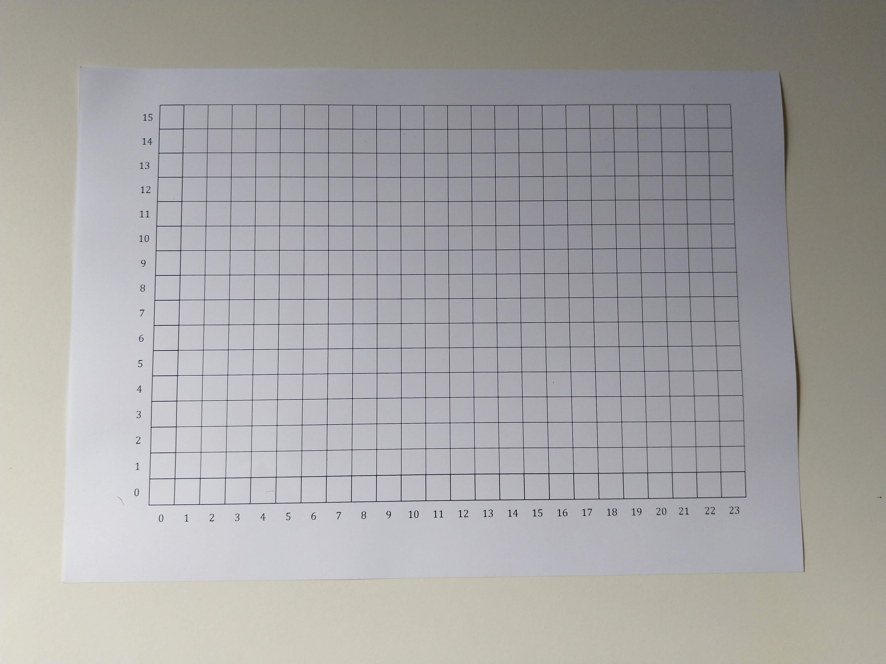
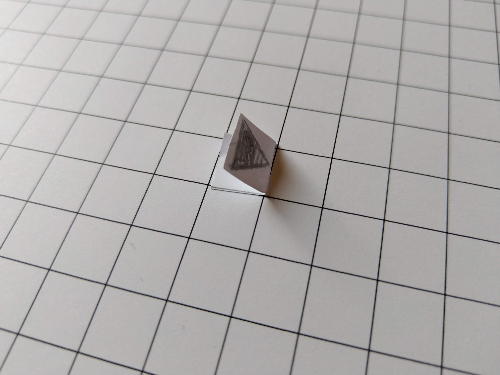
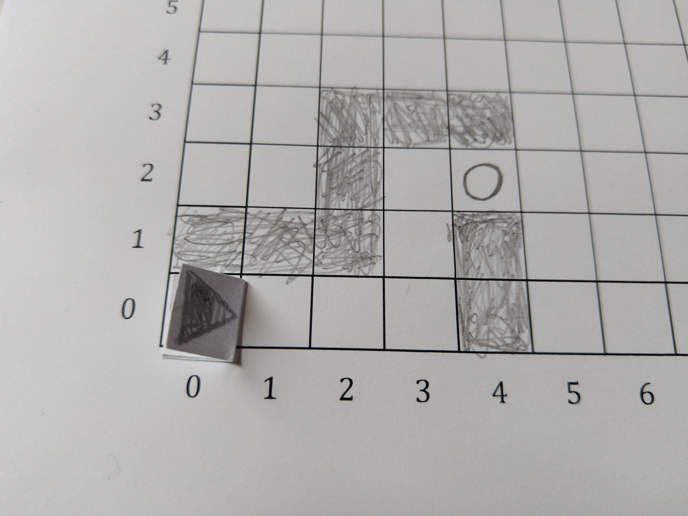
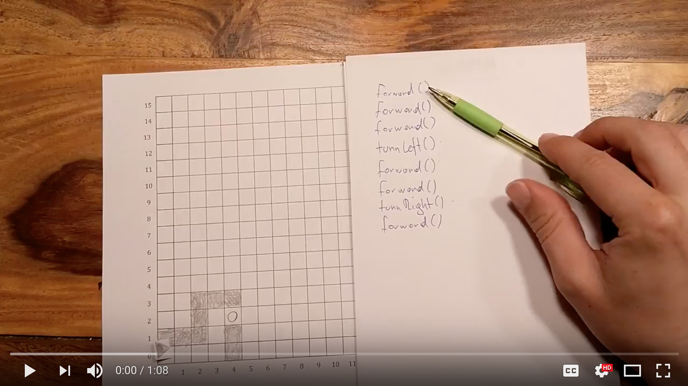

# Paperbots
Paperbots is an analogue, extensible programming game for learning and teaching structured imperative programming.

The player programs a self-made paper robot in the Papyrus programming language to complete quests. A quest is played on a grid on a piece of paper. Each quest consist of instructions on how to setup the grid, and a description of the quest. The player then writes down a program to solve the quest in the Papyrus programming language. Execution of the program is performed by the player themself.

A Paperbots quest may be designed for a single or multiple players. Players may also bring along their library of previously written programs and functions to solve new quests. It is up to the quest designer what is and isn’t allowed.

## Motivation
In the summer of 2018 I was asked to give a half-semester long programming class for kids age 14-18. Two days before the first class, I was informed that the school did not purchase computers as previously agreed upon. Paperbots is (part) of my attempt to solve this conundrum. While preparing the lesson plans for the course, I realized that analogue, paper based systems may have some benefits of digital counter parts.

Paperbots is inspired by digital programming games like [Robocode](https://robocode.sourceforge.io/), [Swift Playgrounds](https://www.apple.com/swift/playgrounds/), or [CodeCombat](https://codecombat.com/). While these digital programming games are closer to "real world" programming, they are hard to extend by beginners. Adding functionality like path finding to a digital programming game requires advanced programming skills and computer science knowledge. In Paperbots, players can declare a new function and merely describe its semantics.

Digital programming games are played on PCs, tablets or phones. Devices offering an infinite amount of distractions. Some of these games also come with an overwhelming interface. Instead of focusing on actual programming, players are forced to first wade through the intricacies of an interface. Paperbots provides a familiar interface without distractions.

Paperbots players automatically learn the skill of [tracing](http://users.csc.calpoly.edu/~jdalbey/101/Resources/codetrace.html). In digital programming games, a computer executes each statement of a program for the player, conveying programming execution by animation (in the best case). In Paperbots, the players execute their own program by manually tracing through it and executing the respective action behind a statement. This process not only includes executing commands, but also updating the values of variables. Of course, complex programs do not lend themselves well to manual execution. However, that may be the point in the learning curve where a beginner can switch to digital means of programming.

Paperbots games can be played anywhere with only a pencil, an eraser and paper. This includes school breaks, bus rides and other contexts where a digital device may not be readily available or even forbidden.

Digital programming games support visual and linguistic learning types, but don't necessarily support the aural or kinesthetic learner. Paperbots supports the visual, linguistic, and kinesthetic learning type.

## Contact & Contributing

It is my hope that this contribution to computer education may help others to teach or learn the basics of programming. If you have feedback, please file an [issue](/issues/), write an email to <mario@badlogicgames.com>, or contact me on [Twitter](https://twitter.com/badlogicgames). I'd be especially grateful for translations of this file!

## Game Setup

To play Paperbots you need:

1. A pencil
2. An eraser
3. A few empty pieces of paper

Paperbots is played on a grid of 1x1cm big cells. The size of the grid depends on the quest that's being played. A grid spanning most of a letter sized paper should be sufficient for most quests.

This repository contains a grid template ([Microsoft Word](grid.docx), [PDF](grid.pdf)) that you can print out. Alternatively, you can use grid paper and draw a grid of 1x1cm cells on it. Here's what the grid template looks like



Sometimes you may want to refer to a specific cell on the grid. To make this easier, the grid template labels the columns and rows with numbers. To specify a cell, you can take its column and row number to form what is called a coordinate. E.g. the cell in the bottom left corner has the coordinate `(0, 0)`, the cell in the top right corner has the coordinate `(23, 15)`, and so on.

> **Note**: the above choice of numbers of columns and rows, as well as the cell size of 1x1cm are completely arbitrary. You can can use a smaller grid, make the cells bigger, or make everything human size!

Next, we need to build a robot that fits into a single cell of our grid. A cell of the template grid is 1x1cm, so that is the maximum size of our robot. The robot must also have a visual indicator showing which direction is forward. You can be as creative as you want when building your robot! You can also be lazy like me, as shown below.



The robot's forward direction is to the right, indicated by the tip of the triangle. I cut out a 2x1cm big piece of paper, folded it in half, and drew a little triangle on it. The fold helps me more easily grab and move the robot.

You should now have:

1. A pencil
2. An eraser
3. A few empty pieces of paper
4. A grid
5. A robot

Let's start with our first quest.

## Quest #1: SOS, I'm stuck


Our robot got stuck in a maintenance tunnel in cell `(0, 0)`, facing to the right. We need it to move back out of the tunnel to the exit in cell `(4, 2)`. To help our robot escape, we need to write a program that it can execute!

### Programming languages - How to talk to a computer.
To tell a computer (or in this case our robot) what we want it to do, we need to communicate with it. We humans communicate through natural language, which is super flexible, but also often very imprecise. Computers are very precise machines, and need to be told *exactly* what we want them to do. No fuzziness allowed!

Computer engineers have thus invented **programming languages** a computer can understand. There are many different programming languages, for different types of computers, and different purposes.

Programming languages and human languages share some similarities. They both have a syntax or grammar we must follow so that the computer or person we communicate with can understand us. Both programming and human languages also have a vocabulary from which we can construct sentences. But that's were the similarities end.

Programming languages are a lot less complex than human languages. Their grammar is much simpler, and their vocabulary is very small. This makes it easier to express exactly what we want the computer to do. But this precise way of talking to a computer can also be a lot more frustrating compared to telling a human what to do.

Our robot understands programs written in the **programming language Papyrus**. As its name indicates, Papyrus programs are written by hand with a pencil on pieces of paper!

A digital computer, like your PC or phone, would be programmed in a different programming language. You'd also not write your program on paper, but instead write your program in a text file and tell the computer to execute it. Alas, we are stuck in the pre-digital age, so paper it is!

### Programs, statements and functions
Every Papyrus program consists of a list of statements. Each statement goes on its own line. Here's one such program:

```
forward()
forward()
turnRight()
forward()
turnLeft()
```

This program consists of 4 statements. When the robot executes this program, it starts at the top most statement, executes it, looks at the next statement, executes it, and so forth, until it reaches the end of the program, at which point it stops doing anything. This is the general principle of all computer programs!

Programming languages like Papyrus let us write different kinds of statements, for different purposes. Each statement in the above program is a **function call** statement. What is a function and what does "calling a function" mean?

Our robot comes equipped with some functionality:

1. It can move one grid cell forward in the direction it is heading in, unless that grid cell is blocked, in which case the robot does not move.
2. It can rotate in-place to the right by 90 degrees (clock-wise).
3. It can rotate in-place to the left by 90 degrees (counter-clock-wise).

All of these actions require different things to happen in the robot, like turning on a motor or firing a rocket engine for a specific amount of time. These tiny actions making up a big action like moving forward must also be programmed and may require many, many statements. Programming all these nitty gritty details every time we want our robot to move forward is very tiresome.

Instead, the smart people that built our robot according to our design already wrote the programs that let the robot move as described above. They gave these  programs names like `forward`, `turnLeft`, and `turnRight`. In fact, they build up an entire **library of small, named programs** for us. We call these tiny, named programs **functions**.

Best of all: we can re-use and execute these functions in our own programs by calling them! This saves us from a lot of writing. It also makes our programs a lot smaller, as we do not have to repeat all the nitty gritty details over and over again. All we need to know about a function is its name and what it does on a conceptual level.

Here are three functions from our robot's function library that we'll need to solve this quest:

1. `forward`: moves the robot one grid cell forward in the direction it is heading in. If the grid cell is blocked, the robot does not move.
2. `turnRight`: rotates the robot in-place to the right by 90 degrees (clock-wise).
3. `turnLeft`: rotates the robot in-place to the left by 90 degrees (counter-clock-wise).

Now all we need to know is the **syntax of calling a function** in our program and we can solve this quest:

```
forward()
```

To call a function in our program, we write its name, like `forward`, or `turnLeft`, followed by parenthesis `()`. Easy!

> **Note**: Why do we need the parenthesis? The short answer: the Papyrus syntax requires it. The long answer: there are other statement types involving named things in Papyrus. The parenthesis allow us to distinguish between these statements and function calls. Many programming languages use this convention, so Papyrus uses it too.

### Solving the quest
With our 3 trusty functions and the function call syntax, we can now write our first Papyrus program and get our robot out of the tunnel.

As a first step, duplicate the quest setup from the image above onto your own grid. As per the quest description, the robot starts at location `(0, 0)` facing to the right, so put your robot there. Let's look at what we have.

The robot needs to get to the exit in cell `(4, 2)`. Let's write down the program to move it there.

First it needs to move 3 cells to the right like this:

```
forward()
forward()
forward()
```

The robot ends up in cell `(3, 0)`. Now it needs to go up 2 cells, but there's a slight problem. The robot is facing in the wrong direction! We can fix this by turning left via the `turnLeft` function, then move forward by 2 cells:

```
turnLeft()
forward()
forward()
```

Great, we've moved the robot to cell `(3, 2)`. All that's left to reach the exit is turning right, and moving one more cell forward:

```
turnRight()
forward()
```

Our final program:

```
forward()
forward()
forward()
turnLeft()
forward()
forward()
turnRight()
forward()
```

What computer do we use to execute this?

### Executing the solution
Surprise, you are the computer! Execute each statement of your program from top to bottom and check the solution. On a call to the function `forward` move your robot one grid cell in the direction it's heading in. On a call to the functions `turnLeft` and `turnRight`, turn your robot in-place, either 90 degrees to the left or right.

Here's me running the program.

[](https://www.youtube.com/watch?v=DgvwRfPVBA8)

> Note: it is often helpful to run only parts of your program to get a better feel for your solution.

### What we've learned
* Computers are told what to do by communicating with them using a programming language.
* Different programming languages are used for different types of computers and purposes.
* Paperbots are programmed in the Papyrus language.
* Programs consist of statements which are executed top to bottom, one after the other.
* A programming language supports different types of statements.
* One type of statement Papyrus supports are function call statements.
* A function is a tiny program with a name.
* We can use other people's functions in our program by calling them like this: `functionName()`.
* Using functions makes our programs smaller, and allows re-using previously written code.

### Exercise
Create mazes of your own, with a start location for the robot and a location for the exit. Write programs for your robot to escape the maze.

## Quest #2: The maze of tediousness
**TODO image of a much larger maze**

Our robot is a little silly and got stuck. Again! This time however, it got stuck in a much larger maze. Help it escape by writing a program.

### Loops - how to not repeat yourself
If you've done the exercise for quest #1, you might have noticed that having to write a function call over and over again can become quite tedious:

```
forward()
forward()
forward()
forward()
forward()
forward()
forward()
```

Many programming languages help you avoid such repetition by giving you a type of statement called a **loop**. A loop lets you execute one or more statements multiple times without you having to manually write it all out.

In Papyrus, you can rewrite the tedious program above like this:

```
repeat 7 times
   forward()
```

Welcome our new best friend: the **repeat statement**! It makes sure the `forward` function is called 7 times in a row, without us having to write it all out.

The number in between `repeat` and `times` can be any positive number, including `0`. Negative numbers are not allowed!

How do we specify which statements beneath the `repeat` statement are repeated and which are not? Let's look at an example:

```
repeat 10 times
   forward()
   turnLeft()
turnRight()
```

Only statements directly below the repeat statement and intended to the right will be repeated. The call to `turnRight` is not part of the repeated list of statements as it is not intended to the right.

The last program is equivalent to this program:

```
forward()
turnLeft()
forward()
turnLeft()
forward()
turnLeft()
forward()
turnLeft()
forward()
turnLeft()
forward()
turnLeft()
forward()
turnLeft()
forward()
turnLeft()
forward()
turnLeft()
forward()
turnLeft()
turnRight()
```

That's a lot less repetitive! Our programs can contain as many `repeat` statements as we want, just like we can add as many function calls as we want.

```
repeat 4 times
   forward()
turnLeft()
repeat 4 times
   forward()
turnLeft()
repeat 4 times
   forward()
turnLeft()
repeat 4 times
   forward()
```

Go ahead, place your robot anywhere on the grid and execute the above program. Congratulations, your robot just ran in circles!

> **Note**: loops like `repeat` are also called **control flow statements**. These types of statements change the order in which other statements are executed in the program. Instead of strictly going from top to bottom, control flow statements may make the program jump to a previous statement, or skip a list of statements. These statements thus control the "flow" of the program.

# Solving the quest
