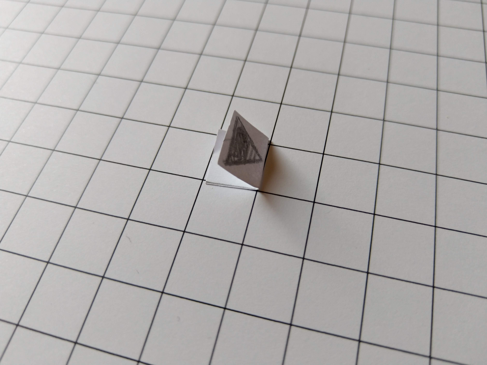
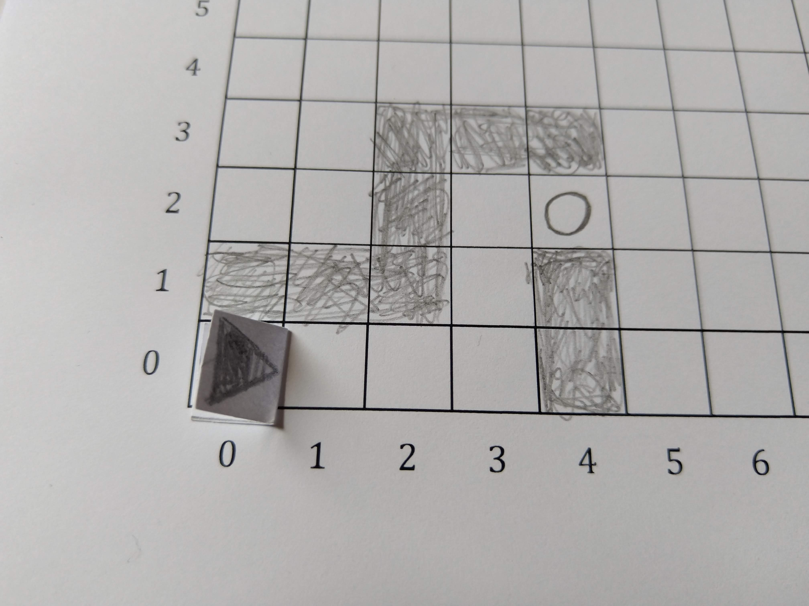
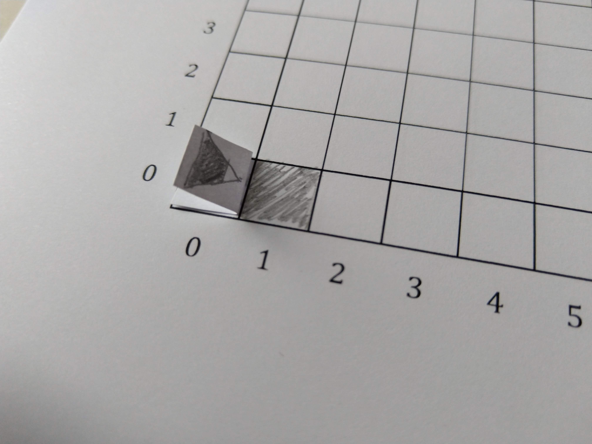
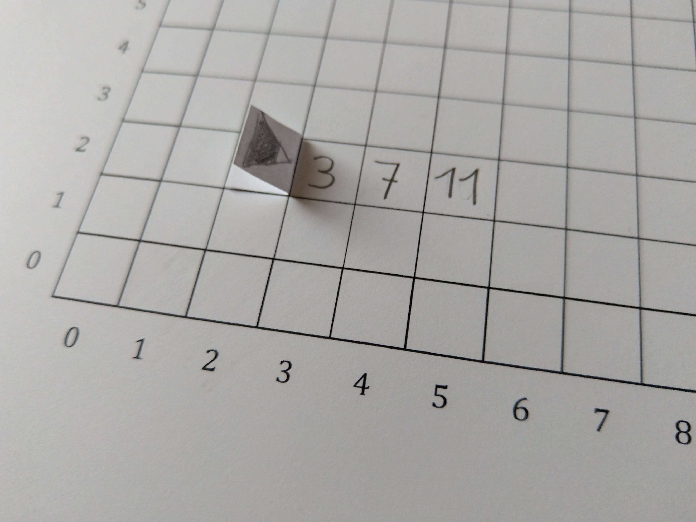
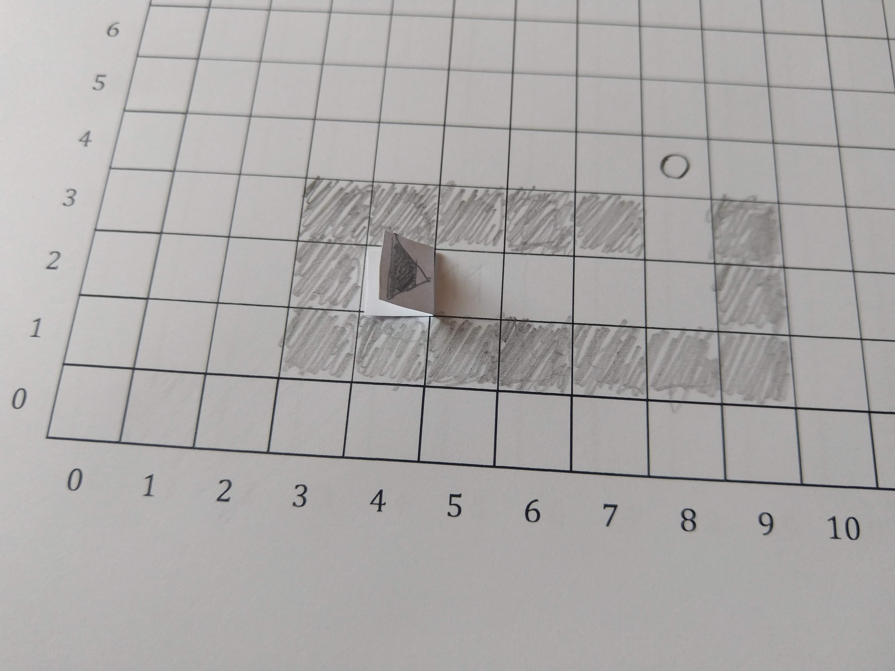

# Paperbots
Paperbots is an analogue, extensible programming game for learning and teaching structured imperative programming.

The player programs a self-made paper robot in the Papyrus programming language to complete quests. A quest is played on a grid on a piece of paper. Each quest consist of instructions on how to setup the grid, and a description of the quest. The player then writes down a program to solve the quest in the Papyrus programming language. Execution of the program is performed by the player themself.

A Paperbots quest may be designed for a single or multiple players. Players may also bring along their library of previously written programs and functions to solve new quests. It is up to the quest designer what is and isn’t allowed.

## Motivation
In the summer of 2018 I was asked to give a half-semester long programming class for kids age 14-18. Two days before the first class, I was informed that the school did not purchase computers as previously agreed upon. Paperbots is (part) of my attempt to solve this conundrum. While preparing the lesson plans for the course, I realized that analogue, paper based systems may have some benefits over digital counter parts.

Paperbots is inspired by digital programming games like [Robocode](https://robocode.sourceforge.io/), [Swift Playgrounds](https://www.apple.com/swift/playgrounds/), or [CodeCombat](https://codecombat.com/). While these digital programming games are closer to "real world" programming, they are hard to extend by beginners. Adding functionality like path finding to a digital programming game requires advanced programming skills and computer science knowledge. In Paperbots, players can declare a new function and merely describe its semantics.

Digital programming games are played on PCs, tablets or phones. Devices offering an infinite amount of distractions. Some of these games also come with an overwhelming interface. Instead of focusing on actual programming, players are forced to first wade through the intricacies of an interface. Paperbots provides a familiar interface without distractions.

Paperbots players automatically learn the skill of [tracing](http://users.csc.calpoly.edu/~jdalbey/101/Resources/codetrace.html). In digital programming games, a computer executes each statement of a program for the player, conveying programming execution by animation (in the best case). In Paperbots, the players execute their own program by manually tracing through it and executing the respective action behind a statement. This process not only includes executing commands, but also updating the values of variables. Of course, complex programs do not lend themselves well to manual execution. However, that may be the point in the learning curve where a beginner can switch to digital means of programming.

Paperbots games can be played anywhere with only a pencil, an eraser and paper. This includes school breaks, bus rides and other contexts where a digital device may not be readily available or even forbidden.

Digital programming games support visual and linguistic learning types, but don't necessarily support the aural or kinesthetic learner. Paperbots supports the visual, linguistic, and kinesthetic learning type.

## Contact & Contributing

It is my hope that this contribution to computer education may help others to teach or learn the basics of programming. If you have feedback, please file an [issue](/issues/), write an email to <mario@badlogicgames.com>, or contact me on [Twitter](https://twitter.com/badlogicgames). I'd be especially grateful for translations of this file!

## Game Setup

To play Paperbots you need:

1. A pencil
2. An eraser
3. A few empty pieces of paper

Paperbots is played on a grid of 1x1cm big cells. The size of the grid depends on the quest that's being played. A grid spanning most of a letter sized paper should be sufficient for most quests.

This repository contains a grid template ([Microsoft Word](grid.docx), [PDF](grid.pdf)) that you can print out. Alternatively, you can use grid paper and draw a grid of 1x1cm cells on it. Here's what the grid template looks like


Sometimes you may want to refer to a specific cell on the grid. To make this easier, the grid template labels the columns and rows with numbers. To specify a cell, you can take its column and row number to form what is called a coordinate. E.g. the cell in the bottom left corner has the coordinate `(0, 0)`, the cell in the top right corner has the coordinate `(23, 15)`, and so on.

> **Note**: the above choice of numbers of columns and rows, as well as the cell size of 1x1cm are completely arbitrary. You can can use a smaller grid, make the cells bigger, or make everything human size!

Next, we need to build a robot that fits into a single cell of our grid. A cell of the template grid is 1x1cm, so that is the maximum size of our robot. The robot must also have a visual indicator showing which direction is forward. You can be as creative as you want when building your robot! You can also be lazy like me, as shown below.



The robot's forward direction is to the right, indicated by the tip of the triangle. I cut out a 2x1cm big piece of paper, folded it in half, and drew a little triangle on it. The fold helps me more easily grab and move the robot.

You should now have:

1. A pencil
2. An eraser
3. A few empty pieces of paper
4. A grid
5. A robot

Let's start with our first quest.

## Quest #1: SOS, I'm stuck


Our robot got stuck in a maintenance tunnel in cell `(0, 0)`, facing to the right. We need it to move back out of the tunnel to the exit in cell `(4, 2)`, marked with `O`. To help our robot escape, we need to write a program that it can execute!

### Programming languages - How to talk to a computer.
To tell a computer (or in this case our robot) what we want it to do, we need to communicate with it. We humans communicate through natural language, which is super flexible, but also often very imprecise. Computers are very precise machines, and need to be told *exactly* what we want them to do. No fuzziness allowed!

Computer engineers have thus invented **programming languages** a computer can understand. There are many different programming languages, for different types of computers, and different purposes.

Programming languages and human languages share some similarities. They both have a syntax or grammar we must follow so that the computer or person we communicate with can understand us. Both programming and human languages also have a vocabulary from which we can construct sentences. And "words" and "sentences" in both programming and human languages have a meaning mutually understood by the parties talking to each other. But that's were the similarities end.

Programming languages are a lot less complex than human languages. Their grammar is much simpler, and their vocabulary is very small. A computer also doesn't understand the real world like we do. It has no concepts or thoughts of its own. It simply does what it is told, using whatever functionality was given to the computer by the engineers who built it. All of this makes it easier to express exactly what we want the computer to do. But this precise way of talking to a computer can also be a lot more frustrating compared to telling a human what to do.

When we want a computer to do something, we don't have a dialogue with it. Instead, we write a **program** in a programming language the computer understands. If you own a PC, a mobile phone, or other type of computer, you have used many different programs! Typically, one or more programmers have written this program together to tell the computer what to show you on the display, how to react to you touching a button, or how to send a chat message to someone else. The programmer has to think of all eventualities and tell the computer how to react in each case. A program is similar to one large recipe, telling the computer exactly what to do in what order. But programs are much more powerful than recipes!

Our paper robot understands programs written in the **programming language Papyrus**. As its name indicates, Papyrus programs are written by hand with a pencil on pieces of paper!

A digital computer, like your PC or phone, would be programmed in a different programming language. You'd also not write your program on paper, but instead write your program in a text file and tell the computer to execute it. Alas, we are stuck in the pre-digital age, so paper it is!

### Programs, statements, and functions
Every Papyrus program consists of a list of **statements**. Each statement goes on its own line. A program can consist of as  many statements as we like, as long as it makes the computer do what we want it to do. Finding this sequence of statements and writing them down as a program is what we call **programming**. Here's one such program our robot understands:

```
forward()
forward()
turnRight()
forward()
turnLeft()
```

This program consists of 4 statements. When the robot executes this program, it starts at the top most statement, executes it, looks at the next statement, executes it, and so forth. When it reaches the end of the program it stops doing anything. This is the general principle of all computer programs!

Programming languages like Papyrus let us write different kinds of statements, for different purposes. Each statement in the above program is a **function call** statement. What is a function and what does "calling a function" mean?

Our robot comes equipped with some functionality:

1. It can move one grid cell forward in the direction it is heading in, unless that grid cell is blocked, in which case the robot does not move.
2. It can rotate in-place to the right by 90 degrees (clock-wise).
3. It can rotate in-place to the left by 90 degrees (counter-clock-wise).

All of these actions require different things to happen in the robot, like turning on a motor or firing a rocket engine for a specific amount of time. These tiny actions making up a big action, like moving forward, must also be programmed and may require many, many statements. Programming all these nitty gritty details every time we want our robot to move forward is very tiresome.

Instead, the smart people that built our robot according to our design already wrote the programs that let the robot move as described above. They gave these  programs names like `forward`, `turnLeft`, and `turnRight`. In fact, they build up an entire **library of small, named programs** for us. We call these tiny, named programs **functions**.

Best of all: we can re-use and execute these functions in our own programs by calling them! This saves us from a lot of writing. It also makes our programs a lot smaller, as we do not have to repeat all the nitty gritty details over and over again. All we need to know about a function is its name and what it does on a conceptual level.

Here are three functions from our robot's function library that we'll need to solve this quest:

* `forward()`: moves the robot one grid cell forward in the direction it is heading in. If the grid cell is blocked, the robot does not move.
* `turnRight()`: rotates the robot in-place to the right by 90 degrees (clock-wise).
* `turnLeft()`: rotates the robot in-place to the left by 90 degrees (counter-clock-wise).

Now all we need to know is the **syntax of calling a function** in our program and we can solve this quest:

```
forward()
```

To call a function in our program, we write its name, like `forward`, or `turnLeft`, followed by parenthesis `()`. Easy!

All we need to do now is figure out which functions we need to call in what order for our robot to move to the exit.

> **Note**: Why do we need the parenthesis? The short answer: the Papyrus syntax requires it. The long answer: there are other statement types involving named things in Papyrus. The parenthesis allow us to distinguish between these statements and function calls. Many programming languages use this convention, so Papyrus uses it too.

### Solving the quest
With our 3 trusty functions and the function call syntax, we can now write our first Papyrus program to get our robot out of the tunnel.

As a first step, duplicate the quest setup from the image above onto your own grid. As per the quest description, the robot starts at location `(0, 0)` facing to the right, so put your robot there facing to the right. Let's look at what we have.

The robot needs to get to the exit in cell `(4, 2)`. Let's write down the program to move it there.

First it needs to move 3 cells to the right until it hits a wall, like this:

```
forward()
forward()
forward()
```

The robot ends up in cell `(3, 0)`. Now it needs to go up 2 cells, but there's a slight problem. The robot is facing in the wrong direction! We can fix this by turning left via the `turnLeft()` function:

```
turnLeft()
```

Next, we move forward another 2 cells, until we hit the next wall:

```
forward()
forward()
```

Great, we've moved the robot to cell `(3, 2)`. All that's left to reach the exit is turning right, and moving one more cell forward:

```
turnRight()
forward()
```

Our final program:

```
forward()
forward()
forward()
turnLeft()
forward()
forward()
turnRight()
forward()
```

Congratulations, you are a programmer now! How did we arrive at our solution? We used **computational thinking**.

We first got a general sense of the problem by looking at the grid and the goal of our quest.

Next, we looked at what functionality our robot provides us (functions to move forward and turn). As programmers, we didn't care what exactly happens under the hood of the robot when we call `forward()`. All we need to know is the effect: the robot moves one cell forward. We also understood, that the robot's 3 functions is all we have at our disposal to solve the problem, which shaped how we arrived at our solution. We used an **abstraction**, or simplification of how we operate the robot.

Then we divided the problem into smaller problems: move to the right until we hit a wall, turn, move up until we hit a wall, turn and move forward. We used **decomposition** to make it easier to solve the problem, by not solving it all at once, but in smaller steps.

Finally, we wrote it all down in one single program that will help the robot escape the tunnel. We created an **algorithm**, or a sequence of actions, to solve the problem.

Abstraction, decomposition and algorithms are what programmers use to solve problems through programming. Now, how do we tell the robot to execute our program?

### Executing the solution
Surprise, you are the computer! Execute each statement of your program from top to bottom and check the solution. On a call to the function `forward()` move your robot one grid cell in the direction it's heading in. On a call to the functions `turnLeft()` and `turnRight()`, turn your robot in-place, either 90 degrees to the left or right.

Here's me running the program.

[](https://www.youtube.com/watch?v=DgvwRfPVBA8)

> Note: it is often helpful to run only parts of your program to get a better feel for your solution.

### What we've learned
* Computers are told what to do by communicating with them using a programming language.
* Different programming languages are used for different types of computers and purposes.
* Paperbots are programmed in the Papyrus language.
* Programs consist of statements which are executed top to bottom, one after the other.
* A programming language supports different types of statements.
* One type of statement Papyrus supports are function call statements.
* A function is a tiny program with a name.
* We can use other people's functions in our program by calling them like this: `functionName()`.
* Using functions makes our programs smaller, and allows re-using previously written code.
* When creating a program to solve a problem, we use computational thinking (abstraction, decomposition, algorithms) to arrive at a solution.

### Exercises
Create mazes of your own, with a start location for the robot and a location for the exit. Write programs for your robot to escape the maze.

## Quest #2: Hello, this is robot.


Our engineers have installed a new module on the robot. With it, the robot can print a number onto the cell in front of it. The engineering team has asked us to take the robot and its new module for a test drive. They want us to print the numbers 1 to 5 on a consecutive horizontal line of cells on the grid, from left to right. The robot should be placed at location `(0, 0)` looking to the right.

The engineering team has provided us with Papyrus specification of a new function that they've added to the robot's function library.

* `print(value: number)`: prints the number given to it via the parameter `value` onto the cell in front of the robot. If the cell already has a number printed on it, that number gets painted over, and the new number is printed onto the cell. If the cell is blocked by a wall or other object, the number is not printed.

### Functions, parameters, and specifications
The functions we've used so far, like `forward()`, didn't need any information from us to do their job. The new `print(value: number)` function  is different. It needs to know what number we want it to print when we call it in our program. To make this work, the function has a **parameter**.

You have actually encountered this concept in the real world without knowing! A hotplate usually has some sort of dial that lets you turn it on at a specific heat level. We could specify this as a function `turnHotplateOn(heat: number)`! Looking around in our kitchen, we find other functions that have more than one parameter. When you turn on your microwave, you have 2 dials: one for the number of minutes you want to microwave your food for, and another one to set the power level. We could specify this as a function `turnMicrowaveOn(minutes: number, power: number)`. A function can have any number of parameters (including zero)!

How do we call a function with parameters in Papyrus? Just like a function without parameters, but we put the values for each parameter inside the parenthesis `()`, separating multiple parameters by a coma `,`.

```
print(7)
turnMicrowaveOn(2, 9)
```

As you can see, there's a difference between the specification of a function, like `turnMicrowaveOn(minutes: number, power: number)` and calling that function in our program, like `turnMicrowaveOn(2, 9)`.

In the specification, we state a name and a **data type** for each parameter. As the user of the function, the name gives us some information about what this parameter is for. The type tells us what kind of data we can pass to the function for that parameter. Both pieces of information help us as the programmer to understand what the function expects from us.

The type of a parameter is also important for the computer to know when it executes our program. So far, we've only seen data of the type `number`. But computers can of course work with different types of data, like text, or images. If we pass data of an incorrect type to a function expecting a different type, the computer will tell us that we have an error in our program! Programmers are forgetful creatures, and its nice to have the computer alert us if we made a silly error. Specifying the types of our parameters helps the computer help us!

When we call the function in our program, we do not care about parameter names and data types anymore, but just want to specify the values we want to pass to the function. The computer already knows the types of parameters from the specification, so we don't need to repeat them. All it needs to perform the data type check for each parameter are the values we pass to the function in question!

> Note: the syntax for function specifications and function calls we use in Papyrus can be found in many other programming languages as well. However, some programming languages might choose a different syntax. No worries, the general concepts are the same!

### Solving the quest
With the `print(value: number)` function, our robot can finally communicate with the outside world, albeit in a very limited way. Let's put on our computational thinking hat and solve this quest.

There's some rubble right next to our robot, so we need to navigate around that before we start printing.

```
turnLeft()
forward()
turnRight()
```

Our robot is now looking along an empty horizontal line of cells, let's print some numbers!

```
print(1)
forward()
print(2)
forward()
print(3)
forward()
print(4)
forward()
print(5)
```

That should do. The engineers were a bit fuzzy when telling us what to do. Did they want us to move the robot off of the numbers into an empty cell? We could call them and ask what they want, but let's just go ahead and deal with this `underspecified problem` by deciding ourselves to move the robot to the end of the line.

```
forward()
forward()
```

And our full program:

```
turnLeft()
forward()
turnRight()
print(1)
forward()
print(2)
forward()
print(3)
forward()
print(4)
forward()
print(5)
forward()
forward()
```

### Executing the solution
Time to run our program. Like before, we go through each statement and perform the action it represents. Here's my running the program.

**TODO video of execution**

### Exercises
Make the robot print the date of your birthday. Start with the year, then the month, then the day.

### What we've learned
* Functions can have zero or more parameters
* A function is specified to a computer as well as a programmer by stating the functions name and all its parameters. In Papyrus, we specify a name and data type for each parameter, separated by a comma. E.g. `turnMicrowaveOn(minutes: number, power: number)`
* To call a function with parameters in a Papyrus program, we pass values of the correct type to the function, e.g. `turnMicrowaveOn(2, 9)`.
* When we call a function with data that does not have the correct data type, the computer tells us we made a programming error.
* Sometimes a problem is underspecified. We can either ask more questions, or decide on a way forward ourselves!

## Quest #3: Return to sender


Hot on the heels of the new printer module, the engineers have added yet another module to the robot. This time, it's a scanner that can read a number from the cell in front of the robot. They want us to test the new module.

For every cell with a number in it, we should scan the number, multiply it by `2` and subtract `1` from it, then print the result to the cell it scanned the original number from. The robot should start at location `(2, 2)` facing to the right, and move to location `(6, 2)`.

The engineering team has provided us with specification of a new function that they've added to the robot's function library.

* `scan(): number`: scans the number in the cell in front of the robot and returns it. If there is no number in the cell in front of the robot, the function returns `0`.

## Functions returning values
So far we've seen functions with and without parameters that executed some action, like `forward()` to move forward, or `print(value: number)` to print a number on a cell.

But often we also want a function to compute something for us and give us back a value, like scanning a number in a cell and returning as that number for use in the rest of our program. That is what **function return values** are for!

In Papyrus, we can see if a function returns a value by looking at its specification. In the case of `scan(): number`, the fact the function returns a value is denoted by the `: number` part. It says "the function `scan()` returns a value of the number data type. This part of the function specification is called **return type**. Functions that don't return a value omit the return type, like in the case of `print(value: number)`. Of course, we can also have functions that both take parameters and return a value. Can you guess what the function `add(a: number, b: number): number` does?.

### Expressions
Our engineers have asked us to read a number and perform some arithmetic on it. But how do we do that?

The answer in Papyrus is to create an **expression**. Expressions appear in a program every time we need a value, e.g. when we call a function that expects one or more parameters as in `print(2)`. Here, `2` is a simple expression, consisting of the value `2` of the type `number`. Every expression eventually boils down to a singe value of a specific data type. But expressions can be much more powerful than just the number `2`!

Computers are naturally good at working with numbers. Our robot is no exception. It can add, subtract, multiply, and divide values of the `number` type. In Papyrus, we can use an **arithmetic expression** to describe an arithmetic calculation to the computer to execute:

```
1 + 3 - 4 * 20 / 5
```

The `+` and `-` symbols are the addition and subtraction **operators**. The `*` and `/` symbols are the multiplication and division operators.

Our robot is smart enough to evaluate the expression above in the correct order. We know that multiplication and division are always evaluated before addition and subtraction, and so does the robot!

The robot would evaluate the above expression to `-12`, like a good math citizen (check it). But where does that value derived from the expression go?

Well, nowhere if we don't use it! The robot would simply discard the value and move on to the next statement in the program. So let's pass it to a function:

```
print(1 + 3 - 4 * 20 / 5)
```

And sure enough, our robot would print `-12` onto the cell in front of it! Why does this work? The `print(value: number)` function expects us to pass a number as the first parameter. As we've just learned, expressions are always evaluated to a single value of a specific type. In case of arithmetic expressions, we get a value of type `number`, which we can pass to the function.

But it gets crazier! We know the `scan(): number` function returns a number to us. How can we use that number? In an arithmetic expression of course!

```
print(2 + scan() / 3)
```

Assume the robot stands in front of a cell with the number `6` in it. When this line of code is executed, the robot calls the `scan()` function, which returns the number `6`. The robot then uses this number in the rest of the arithmetic expression, which becomes `2 + 6 / 3`, which the robot can evaluate to the number `4`. Now we have a single `number` value to pass to our `print(value: number)` function.

Anywhere in our program where a `number` is expected, we can use an expression that evaluates to a value of the `number` type. The expression can be a simple number like `2`, or a complex arithmetic expression like `scan() + 3 * scan() - 2`.

### Solving the quest
Computational thinking time! We have a few new tools at our disposal: the `scan(): number` function and expressions. Let's put them to work!

Our robot is already looking at the first cell with a number. So let's scan in the number, calculate a new number based on the formula the engineers gave us, and finally overwrite the old number with the result of the calculation. Once we are done, we can move to the next cell.

```
print(scan() * 2 - 1)
forward()
```

Hm, looks like we have a **pattern** here that we can simply repeat. Our final program looks like this:

```
print(scan() * 2 - 1)
forward()
print(scan() * 2 - 1)
forward()
print(scan() * 2 - 1)
forward()
```

Wow, that was way easier than anticipated.

### Executing the solution
Like before, we evaluate one statement after the other. But we need to be very careful about the order in which we evaluate the parts of our statements, like function calls and expressions!

Before we can execute the `print(value: number)` function, we have to evaluate the arithmetic expression to a single value of type `number`. Looking at the expression, we see that we don't have the value returned from `scan(): number` yet, so let's execute that function. It returns the value `3`, which we can plug into the rest of the expression. Great, everything is a number, so we can calculate the expression result: `5`. Now we have all we need to call and execute the `print(value: number)` function.

The rest of the program follows the same mechanism. Here's me running the program.

**TODO video of execution**

### Exercise
With the `print(value: numer)` and `scan(): number` functions the robot can now communicate with the outside world. By printing, it can store information on the grid. Can you find a way to count from 1 to 5 by using these two functions and expressions?

### What we've learned
* Functions can not only receive values through parameters, but also return values to us to use in the rest of our program.
* In Papyrus, we specify that a function returns a value by appending the returned value's data type at the end of the function specification. E.g. `scan(): number`.
* For functions that don't return a value, we omit the return value type. E.g. `forward()`, or `print(value: number)`.
* Anywhere in our program where we need a value of a specific data type, we can write an expression producing a value of that type. E.g. calling `print(value: number)` requires us to pass a number value.
* For number values we can write arbitrarily complex arithmetic expressions like `3 + 4 * 10 / 30`. The `+` stands for addition, the `-` for subtraction, the `*` for multiplication and the `/` for division. These operators only work with `number` values!
* The computer knows to evaluate the arithmetic expression in the correct order: multiplication and division before addition and subtraction. E.g. `3 + 4 * 5 / 2` evaluates to `1`.
* If an expression contains a call to a function returning a value, the function is executed first before the expression is evaluated. E.g. `2 + 3 * scan()` would first execute `scan()` which returns a number. The number is then substituted into the rest of the expression.

## Quest #4: More than the sum of its parts

Our robot has been exploring an old cavern and reached its end. We'd want it to move back out and, while doing so, count how many cells make up the cavern. Once it has exited the cavern, the robot should print the cell count onto cell `(8, 4)`, indicated by the `0`. The cell count should include the cell the robot starts in. The robot starts in cell `(4, 2)`, facing to the right.

### Data storage
Computers are not only good at working with numbers. They are also pretty great when it comes to storing and retrieving data.

Data like photos, videos, music or documents are usually stored on a hard drive. When you turn a computer off, the data on a hard drive doesn't vanish! Storing and retrieving data to and from a hard drive can be very slow though. When we want to memorize values like a calculation result in our programs, we want access to it to be fast! Luckily, almost all computers come with a component called **random access memory** (RAM) or memory for short.

Storing and retrieving values to and from this memory is very fast and a great place to store (temporary) values our program is working with.

### Variables
In Papyrus, an expressions like `3 + 4 * 5` gets evaluated to the value `23`. This value is temporarily stored in memory, until it is no longer needed. We don't know where in memory the value is stored, and have no way to access it after its been used, e.g. after we've passed it to a function like `print(3 + 4 * 5)`.

For our quest, we need to make the robot count the number of cells it crossed, and print that count at the end. We therefor need a way to temporarily store the current count value somehow. That's where **variables** come in handy!

In Papyrus, a variable is a name for a storage location in memory that can hold a value of a specific data type. We can create a variable with a **variable declaration statement**:

```
count: number = 0
```

This tells the robot to reserve storage in memory big enough to store a `number` and copy the initial value `0` to it. Without this initial value, the contents of the variable would be undefined, which would obviously be bad!

In our program, we can refer to that variable by the name `count`. We can give variables any name we want, as long as there's no other variable of the same name.

> Note: just like with parameters, we specified a name and a type. In both cases we used the syntax `name: type`. This is a recurring theme!

To store a value in our variable, we use an **assignment statement** in Papyrus. Here's an arbitrary example:

```
count = 3 * 4 + scan()
```

The right side after the **assignment operator** `=` is an expression the robot first evaluates to a single `number` value (12 plus whatever number `scan(): number` returns). It then stores this value in the variable given by the name `count` on the left side of the assignment operator.

The general syntax of an assignment statement is `variableName = expression`, where the type of the variable must match the type of the expression. If that is not the case, the computer will tell us that we have an error. It obviously makes no sense to store an image in a variable that can only hold a `number`.

Great, we now know how to temporarily store values in a variable. How about retrieving the value from the variable and using it? Easy:

```
print(2 + 3 * count)
```

Aha! We simply use the variable name in an expression, like we use numbers! Of course, the type of the variable must match the types in the rest of the expression. In this case, we know count is a `number`. The expression is an arithmetic expression, so operating on numbers as well. Everything it good!

### Solving the quest
Let's put variables to work! Our robot is supposed to count all cells it touches, including its starting cell, until it reaches cell `(8, 3)`. We'll use a variable to count the cells. Since we also need to count the start cell, we initialize it to `1`:

```
cellCount: number = 1
```

Next we need to move the robot through the cavern, increasing the cell count for every new cell we move onto. For the first cell, this may look like this:

```
forward()
cellCount = cellCount + 1
```

Now that's an interesting expression! It will take the old variable value, add one to it, and store that new value back into the variable. What about the rest of the cells? Looks like we can just re-use this pattern!

```
forward()
cellCount = cellCount + 1
forward()
cellCount = cellCount + 1
forward()
cellCount = cellCount + 1
```

We've hit the right most wall, so let's turn, then move forward again:

```
turnLeft()
forward()
cellCount = cellCount + 1
```

We've reached the exit of the cavern, so let's finish our job and print the number of cells that make up the cavern onto cell `(8, 4)` in front of the robot.

```
print(cellCount)
```

Here's our full program:

```
cellCount: number = 1
forward()
cellCount = cellCount + 1
forward()
cellCount = cellCount + 1
forward()
cellCount = cellCount + 1
forward()
cellCount = cellCount + 1
turnLeft()
forward()
cellCount = cellCount + 1
print(cellCount)
```

### Executing the solution
Time to see how big the cavern is. But how do we handle variables and their content? We somehow need to keep track what variable stores what value at specific points in our program. Here's how you can do that.

1. Take a separate piece of paper. Let's call it the memory paper.
2. Execute your program as usual
3. If you encounter a variable declaration statement like `count: number = 0`, note down the variable name at the top of the memory paper. If there's already a variable, place the new variable on the right of that variable, and separate them by a vertical line. Write the initial value of the variable beneath the variable name on the paper.
4. If you encounter a variable name in an expression, look up its value on the memory paper and use it to evaluate the expression.
5. IF you encounter an assignment statement, evaluate the right hand expression, then write the resulting value to the memory paper, beneath the last value of the variable.

Here's me executing our program.

** TODO video of execution **

### Exercise
In quest #3, we learned about the `scan(): number` function and calculated and printed some new values based on numbers we scanned. Take the same quest, but this time, add add all the scanned numbers together, and print the result in the empty cell right to the last cell with a number in it. Congratulations, you've created a calculator bot!

### What we've learned
* Computers are great at storing and retrieving data
* Data that should survive turning off the computer or closing a program is written to a hard drive. This can be slow.
* Data we want to store temporarily for the duration of (parts of) our program can be stored in memory for faster access.
* In Papyrus, we can reserve a location in memory via a variable declaration statement like `count: number = 0`. This creates a storage location that can hold a number, and copies the value `0` to it.
* In Papyrus, we can store a new value to a variable via an assignment statement like `count = 3 + 2`. The right hand expression is first evaluated to a value and then gets stored to the memory location of the variable `count`. The type of the variable and the value generated by the expression must match.
* In Papyrus, we can retrieve the value of a variable and use it in an expression like `print(count * 2)`.

## Quest #5: The maze of tediousness
**TODO image of a much larger maze**

Our robot is a little silly and got stuck. Again! This time however, it got stuck in a much larger maze. Help it escape by writing a program.

### Loops - how to not repeat yourself
If you've done the exercise for quest #1, you might have noticed that having to write a function call over and over again can become quite tedious:

```
forward()
forward()
forward()
forward()
forward()
forward()
forward()
```

Many programming languages help you avoid such repetition by giving you a type of statement called a **loop**. A loop lets you execute one or more statements multiple times without you having to manually write it all out.

In Papyrus, you can rewrite the tedious program above like this:

```
repeat 7 times
   forward()
end
```

Welcome our new best friend: the **repeat statement**! In the above example, it makes sure the `forward()` function is called 7 times in a row, without us having to write it all out.

The number in between `repeat` and `times` can be any positive number, including `0`. Negative numbers are not allowed and will result in an error when the program is executed. Of course you can use any expression that evaluates to a `number` to specify the number of repetitions.

How do we specify which statements beneath the `repeat` statement are repeated and which are not? Let's look at another example:

```
count: number = 10
repeat count times
   forward()
   turnLeft()
end
turnRight()
```

Only statements between `repeat` and `end` will be repeated for `count` (or `10`) times. The call to `turnRight()` is not part of the repeated list of statements as it is not between `repeat` and `end`.

Note that we've **indented** the statements inside the `repeat` loop to the right by adding 3 spaces in front of them. This indendation makes it easier for us to see which statements are part of the loop and will be repeated. Some people prefer using tabulators for indentation. There are pros and contras for each style. Ultimately, you should pick one style and use it everywhere for consistency.

The last program is equivalent to this program:

```
forward()
turnLeft()
forward()
turnLeft()
forward()
turnLeft()
forward()
turnLeft()
forward()
turnLeft()
forward()
turnLeft()
forward()
turnLeft()
forward()
turnLeft()
forward()
turnLeft()
forward()
turnLeft()
turnRight()
```

That's a lot less repetitive! Our programs can contain as many `repeat` statements as we want, just like we can add as many function calls as we want.

```
repeat 4 times
   forward()
end
turnLeft()
repeat 4 times
   forward()
end
turnLeft()
repeat 4 times
   forward()
end
turnLeft()
repeat 4 times
   forward()
end
turnLeft()
```

Go ahead, place your robot anywhere on the grid and execute the above program. Congratulations, your robot just ran in circles!

But we can make this program even smaller! Yes we can: `repeat` statements can be nested!

```
repeat 4 times
   repeat 4 times
      forward()
    end
    turnLeft()
end
```

Let's dissect this. The robot will execute the statements inside the outer most `repeat` statement 4 times. We can show that this program is equivalent to the previous program, by getting rid of the outer most `repeat` statement and instead manually repeating the statements inside that repeat statement 4 times. Try it!

> **Note**: loops like `repeat` are also called **control flow statements**. These types of statements change the order in which other statements are executed in the program. Instead of strictly going from top to bottom, control flow statements may make the program jump to a previous statement, or skip a list of statements. These statements thus control the "flow" of the program.

# Solving the quest
The `repeat` statement makes solving this quest rather simple. Let's start by navigating our robot through the first vertical line of cells:

```
repeat 10 times
   forward()
end
```

Next we need to get around the corner

```
turnRight()
forward()
forward()
turnRight()
```

Now it can move downwards until it hits another wall.

```
repeat 5 times
   forward()
end
```

All that's left is moving around the next corner and then to the exit.

```
turnLeft()
forward()
forward()
turnLeft()

repeat 5 times
   forward()
end
```

Yay, the robot escaped!

### Executing the solution
When executing a `repeat` statement, we need to keep track of the number of repetitions to execute, and how many repetitions we've already executed. Here's how you can do this:

1. When you encounter a `repeat` statement, evaluate the expression specifying how often the list of statements inside the `repeat` should be repeated. Write that down on a piece of paper.
2. Execute the statements inside the `repeat`.
3. Everytime you complete a repetition, draw a vertical stroke next to the repetition number you noted down in step 1.
4. If there aren't as many strokes as repetitions you need to execute, go to step 2.
5. If there are as many strokes as repetitions to execute, continue with the next statement after the `end` belonging to the repetition.

Here's me executing the solution.

** TODO video of execution **

### Exercise
Solve quests #3 and #4 using the `repeat` statement. Check the difference in code size between your original solution and the solution using `repeat`!

### What we've learned
* Programs often contain repetitive patterns.
* Loops can help shorten such code and make it clearer, by letting us write the pattern once and repeating it for a certain amount of times.
* In Papyrus, one way to loop a list of statements is to use the `repeat` statement.
* The `repeat` statements syntax is `repeat <number expression> times <list of statements> end`.
* The `number` of times the list of statements should be repeated must be greater or equal to `0`.
* All statements in between the `repeat <number expression> times` and `end` will be executed as many times as specified by the number between `repeat` and `times`.
* To make it more obvious which statements are inside a `repeat` loop, we indent them to the right by spaces or a tabulator.
* Loops can be nested, which means putting a loop inside a loop (inside another loop, ...).

## Quest #6: Hitting a wall
The engineers have outfitted the robot with another sensor that can tell us if there is a wall in front of it or not. They want us to test the new sensor by writing a program that let's the robot move forward until it hits a wall. The robot starts at location `(0,0)`, facing to the right.

The engineering team has provided us with specification of a new function that they've added to the robot's function library.

* `isWallAhead(): boolean`: scans the cell in front of the robot. If there is a wall, the function returns the `boolean` value `true`. If there is no wall, the function returns the `boolean` value `false`.

### Booleans - what is true and false
Often we encounter situations, where we only need to know if something is true or false, like whether there's a wall ahead of us or not. We could use a `number`, say `0` for false, and `1` for true to encode such data. But that's a bit messy, as we now need to remember which number stands for what value. We also need to make sure that we handle all other numbers that don't correspond to `0` and `1`!

Many programming languages, including Papyrus, thus have a data type that allows us to store two values: `true` and `false`. This data type is usually called `boolean` (sometimes also `bool`), named after mathematician [George Boole](https://en.wikipedia.org/wiki/George_Boole).

Everytime we need to work with data that can be either `true` or `false` we use the `boolean` data type. While the `number` data type can repesent any decimal number value, the `boolean` data type can only represent the values `true` and `false`.

Creating and using a boolean variable works just like creating a `number` variable.

```
var isItTrue: boolean = false
isItTrue = true
```

Here, we specify that the variable `isItTrue` has the data type `boolean`, meaning that we can only store the values `true` or `false` in such a variable. The following would be an error:

```
var isItTrue: boolean = 0
```

Since the value `0` has the data type `number`, we can't store it in a variable that can only store `boolean` values!

Similarly, using a `boolean` value in an arithmetic expression, that is an expression using the operators `+`, `-`, `*` and `/` on `number` values, is an error too:

```
2 + true / false
```

This obviously makes no sense!

We also can't print a `boolean` value with our `print(value: number)` function, as it expects a `number` as an argument, and not a `boolean`!

```
print(true)
```
But we can call our new function `isWallAhead(): boolean` and store the returned `boolean` value in a `boolean` variable.

```
var wallAhead = isWallAhead()
```

That's not a lot we can do with `boolean` values. Surely, that can't be all?

### While - loop until told otherwise


